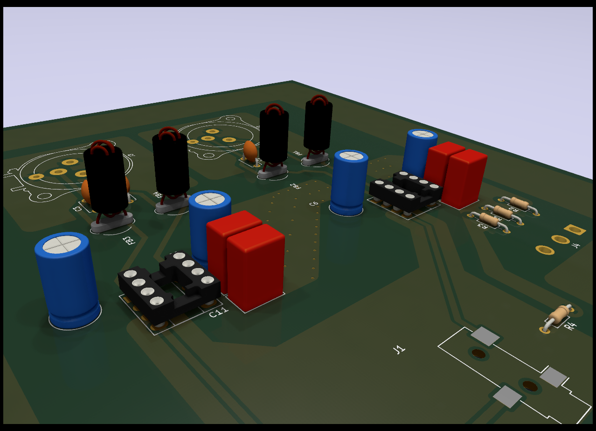
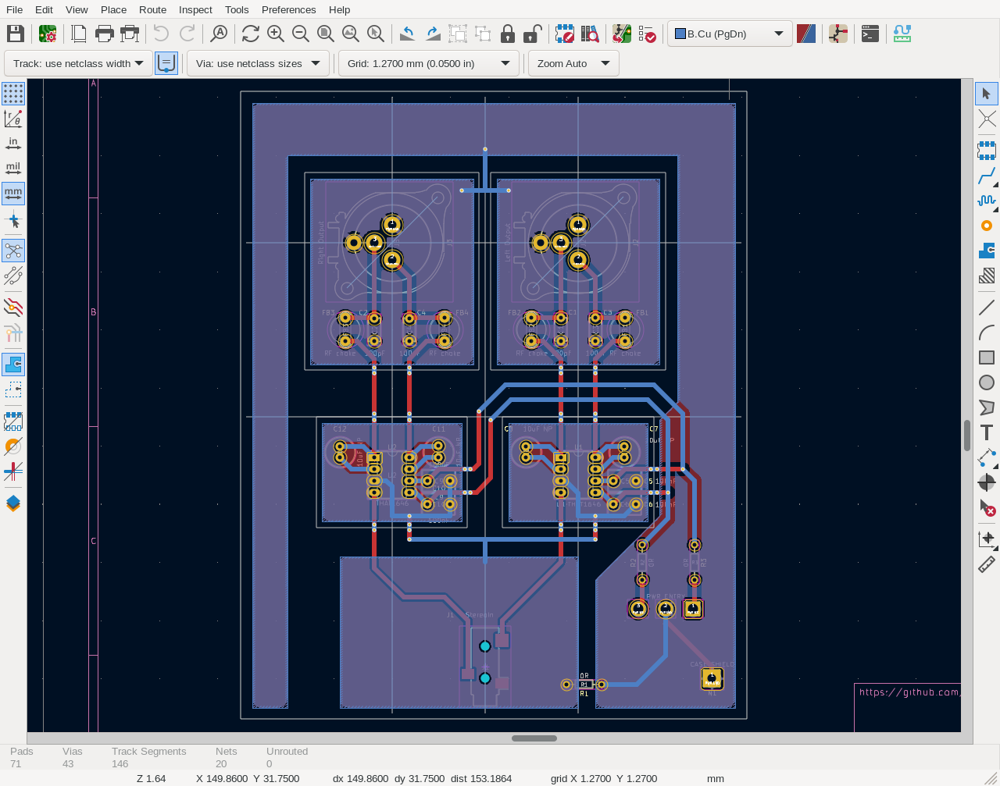

[NOTE]
This is Work In Progress

Audio (XLR) Inputs and Outputs Open Source Hardware
project for use with libre software.

https://raw.githubusercontent.com/nedko/xlrdac/main/xlrdac-sch.pdf[Schematic], in PDF format.

Tools:

 * KiCAD - schematics and PCB design
